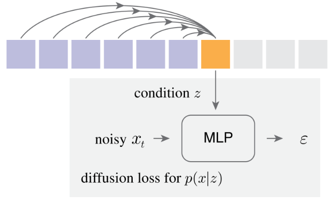
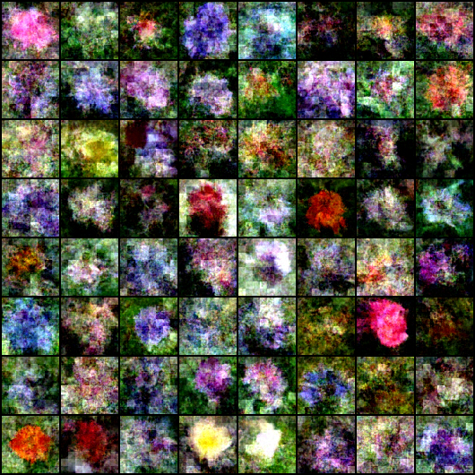

</img>

## Autoregressive Diffusion - Pytorch

Implementation of the architecture behind <a href="https://arxiv.org/abs/2406.11838">Autoregressive Image Generation without Vector Quantization</a> in Pytorch

Official repository has been released <a href="https://github.com/LTH14/mar">here</a>

<a href="https://github.com/lucidrains/transfusion-pytorch">Alternative route</a>

</img>

*oxford flowers at 96k steps*

## Install

```bash
$ pip install autoregressive-diffusion-pytorch
```

## Usage

```python
import torch
from autoregressive_diffusion_pytorch import AutoregressiveDiffusion

model = AutoregressiveDiffusion(
    dim_input = 512,
    dim = 1024,
    max_seq_len = 32,
    depth = 8,
    mlp_depth = 3,
    mlp_width = 1024
)

seq = torch.randn(3, 32, 512)

loss = model(seq)
loss.backward()

sampled = model.sample(batch_size = 3)

assert sampled.shape == seq.shape

```

For images treated as a sequence of tokens (as in paper)

```python
import torch
from autoregressive_diffusion_pytorch import ImageAutoregressiveDiffusion

model = ImageAutoregressiveDiffusion(
    model = dict(
        dim = 1024,
        depth = 12,
        heads = 12,
    ),
    image_size = 64,
    patch_size = 8
)

images = torch.randn(3, 3, 64, 64)

loss = model(images)
loss.backward()

sampled = model.sample(batch_size = 3)

assert sampled.shape == images.shape

```

An images trainer

```python
import torch

from autoregressive_diffusion_pytorch import (
    ImageDataset,
    ImageAutoregressiveDiffusion,
    ImageTrainer
)

dataset = ImageDataset(
    '/path/to/your/images',
    image_size = 128
)

model = ImageAutoregressiveDiffusion(
    model = dict(
        dim = 512
    ),
    image_size = 128,
    patch_size = 16
)

trainer = ImageTrainer(
    model = model,
    dataset = dataset
)

trainer()
```

For an improvised version using flow matching, just import `ImageAutoregressiveFlow` and `AutoregressiveFlow` instead

The rest is the same

ex.

```python
import torch

from autoregressive_diffusion_pytorch import (
    ImageDataset,
    ImageTrainer,
    ImageAutoregressiveFlow,
)

dataset = ImageDataset(
    '/path/to/your/images',
    image_size = 128
)

model = ImageAutoregressiveFlow(
    model = dict(
        dim = 512
    ),
    image_size = 128,
    patch_size = 16
)

trainer = ImageTrainer(
    model = model,
    dataset = dataset
)

trainer()
```

## Citations

```bibtex
@article{Li2024AutoregressiveIG,
    title   = {Autoregressive Image Generation without Vector Quantization},
    author  = {Tianhong Li and Yonglong Tian and He Li and Mingyang Deng and Kaiming He},
    journal = {ArXiv},
    year    = {2024},
    volume  = {abs/2406.11838},
    url     = {https://api.semanticscholar.org/CorpusID:270560593}
}
```

```bibtex
@article{Wu2023ARDiffusionAD,
    title     = {AR-Diffusion: Auto-Regressive Diffusion Model for Text Generation},
    author    = {Tong Wu and Zhihao Fan and Xiao Liu and Yeyun Gong and Yelong Shen and Jian Jiao and Haitao Zheng and Juntao Li and Zhongyu Wei and Jian Guo and Nan Duan and Weizhu Chen},
    journal   = {ArXiv},
    year      = {2023},
    volume    = {abs/2305.09515},
    url       = {https://api.semanticscholar.org/CorpusID:258714669}
}
```

```bibtex
@article{Karras2022ElucidatingTD,
    title   = {Elucidating the Design Space of Diffusion-Based Generative Models},
    author  = {Tero Karras and Miika Aittala and Timo Aila and Samuli Laine},
    journal = {ArXiv},
    year    = {2022},
    volume  = {abs/2206.00364},
    url     = {https://api.semanticscholar.org/CorpusID:249240415}
}
```

```bibtex
@article{Liu2022FlowSA,
    title   = {Flow Straight and Fast: Learning to Generate and Transfer Data with Rectified Flow},
    author  = {Xingchao Liu and Chengyue Gong and Qiang Liu},
    journal = {ArXiv},
    year    = {2022},
    volume  = {abs/2209.03003},
    url     = {https://api.semanticscholar.org/CorpusID:252111177}
}
```

```bibtex
@article{Esser2024ScalingRF,
    title   = {Scaling Rectified Flow Transformers for High-Resolution Image Synthesis},
    author  = {Patrick Esser and Sumith Kulal and A. Blattmann and Rahim Entezari and Jonas Muller and Harry Saini and Yam Levi and Dominik Lorenz and Axel Sauer and Frederic Boesel and Dustin Podell and Tim Dockhorn and Zion English and Kyle Lacey and Alex Goodwin and Yannik Marek and Robin Rombach},
    journal = {ArXiv},
    year    = {2024},
    volume  = {abs/2403.03206},
    url     = {https://api.semanticscholar.org/CorpusID:268247980}
}
```
