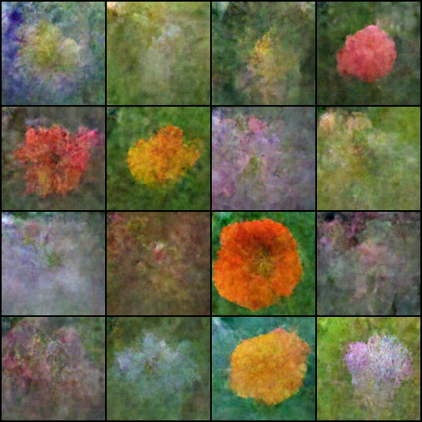

</img>

## Autoregressive Diffusion - Pytorch

Implementation of the architecture behind <a href="https://arxiv.org/abs/2406.11838">Autoregressive Image Generation without Vector Quantization</a> in Pytorch

</img>

*oxford flowers at 59k steps*

## Install

```bash
$ pip install autoregressive-diffusion-pytorch
```

## Usage

```python
import torch
from autoregressive_diffusion_pytorch import AutoregressiveDiffusion

model = AutoregressiveDiffusion(
    dim = 1024,
    max_seq_len = 32,
    depth = 8,
    mlp_depth = 3,
    mlp_width = 1024
)

seq = torch.randn(3, 32, 512)

loss = model(seq)
loss.backward()

sampled = model.sample(batch_size = 3)

assert sampled.shape == seq.shape

```

For images treated as a sequence of tokens (as in paper)

```python
import torch
from autoregressive_diffusion_pytorch import ImageAutoregressiveDiffusion

model = ImageAutoregressiveDiffusion(
    model = dict(
        dim = 1024,
        depth = 12,
        heads = 12,
    ),
    image_size = 64,
    patch_size = 8
)

images = torch.randn(3, 3, 64, 64)

loss = model(images)
loss.backward()

sampled = model.sample(batch_size = 3)

assert sampled.shape == images.shape

```

## Citations

```bibtex
@article{Li2024AutoregressiveIG,
    title   = {Autoregressive Image Generation without Vector Quantization},
    author  = {Tianhong Li and Yonglong Tian and He Li and Mingyang Deng and Kaiming He},
    journal = {ArXiv},
    year    = {2024},
    volume  = {abs/2406.11838},
    url     = {https://api.semanticscholar.org/CorpusID:270560593}
}
```

```bibtex
@article{Wu2023ARDiffusionAD,
    title     = {AR-Diffusion: Auto-Regressive Diffusion Model for Text Generation},
    author    = {Tong Wu and Zhihao Fan and Xiao Liu and Yeyun Gong and Yelong Shen and Jian Jiao and Haitao Zheng and Juntao Li and Zhongyu Wei and Jian Guo and Nan Duan and Weizhu Chen},
    journal   = {ArXiv},
    year      = {2023},
    volume    = {abs/2305.09515},
    url       = {https://api.semanticscholar.org/CorpusID:258714669}
}
```
